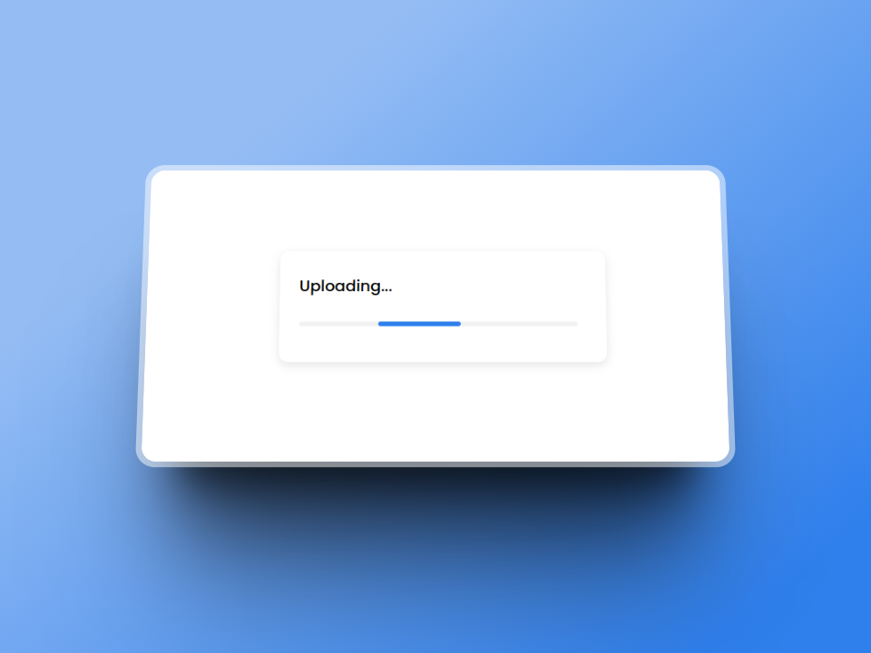

# Image Uploader

This is a simple image uploader that allows you to upload images and get a link to share them with others. It is built with Next.js and uses a simple API(Express) as a backend.

## Features

- Upload images
- Get a link to share images with others

## Screenshots





## Demo

You can try the app [here](https://nextjs.org/)(Deploying).

## Built With

- [Next.js](https://nextjs.org/)
- [TypeScript](https://www.typescriptlang.org/)
- [CSS Modules](https://nextjs.org/docs/app/building-your-application/styling/css-modules)
- [Cloudinary](https://cloudinary.com/)
- [Vercel](https://vercel.com/)

## Getting Started

To get a local copy up and running follow these simple steps.

### Prerequisites

- Node.js
- npm

### Installation

1. Clone the repo, or download the zip file

   ```bash
   git clone git@github.com:Camilo-J/ImageUploader.git
   ```

2. Install NPM packages

   ```bash
   npm install
   ```

3. Create a `.env.local` file in the root directory and add the following variables

   ```sh
    NEXT_PUBLIC_API_URL= your backend url
    FRONT_IMAGE_DOMAIN= your image domain
   ```

4. Run the app

   ```bash
   npm run dev
   ```

## License

Distributed under the MIT License. See `LICENSE` for more information.
